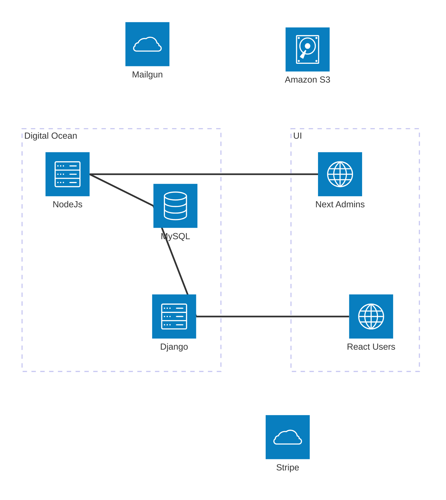

# BHMC API

Django REST API for the Bunker Hills Men's Club golf organization. Serves as the content server for the React frontend, managing events, registrations, payments, and member data.



## Tech Stack

- Django 5.2 + Django REST Framework
- MySQL 8.4
- Stripe (payment processing)
- Amazon S3 (document/photo storage via django-storages + boto3)
- Redis (caching)

## Django Apps

| App | Purpose |
|-----|---------|
| core | User management, authentication, season settings |
| events | Tournaments, event fees, rounds, results |
| register | Player profiles, registrations, slots, fees |
| payments | Stripe payments and refunds |
| courses | Golf courses and hole data |
| damcup | Season-long points competition |
| scores | Event scoring and scorecards |
| documents | Photos and document management |
| messaging | Announcements and contact messages |
| policies | Club policies and rules |
| content | Tags and page content |

## Development

```bash
# Install dependencies
uv sync

# Run server
uv run python manage.py runserver

# Run tests
uv run python manage.py test

# Run migrations
uv run python manage.py migrate

# Docker (MySQL, Redis, Django)
docker-compose up
```

## Environment

Set `DJANGO_ENV` to control configuration:
- `local` - uses `config/.env.local`
- `docker` - uses `config/.env.docker`
- `prod` - uses `config/.env`

Key variables: `SECRET_KEY`, `STRIPE_*`, `DATABASE_*`, `AWS_*`

## API Endpoints

All routes under `/api/`:

- `/events/` - Event management
- `/players/` - Player profiles
- `/registration/` - Event registrations
- `/registration-slots/` - Registration slots
- `/registration-fees/` - Registration fees
- `/payments/` - Payment records
- `/refunds/` - Refund records
- `/courses/` - Course data
- `/scores/` - Event scores
- `/dam-cup/` - Dam Cup standings
- `/documents/` - Documents
- `/photos/` - Photos
- `/news/` - Announcements
- `/policies/` - Club policies
- `/settings/` - Season settings

Stripe webhooks: `/api/hooks/stripe/acacia/`, `/api/hooks/stripe/clover/`

## Authentication

Token-based authentication via [Djoser](https://djoser.readthedocs.io/).

| Endpoint | Description |
|----------|-------------|
| `POST /auth/token/login/` | Obtain auth token (email + password) |
| `POST /auth/token/logout/` | Invalidate current token |
| `POST /auth/users/` | Register new user |
| `POST /auth/users/reset_password/` | Request password reset |
| `POST /auth/users/reset_password_confirm/` | Confirm password reset |

Include token in requests: `Authorization: Token <token>`
